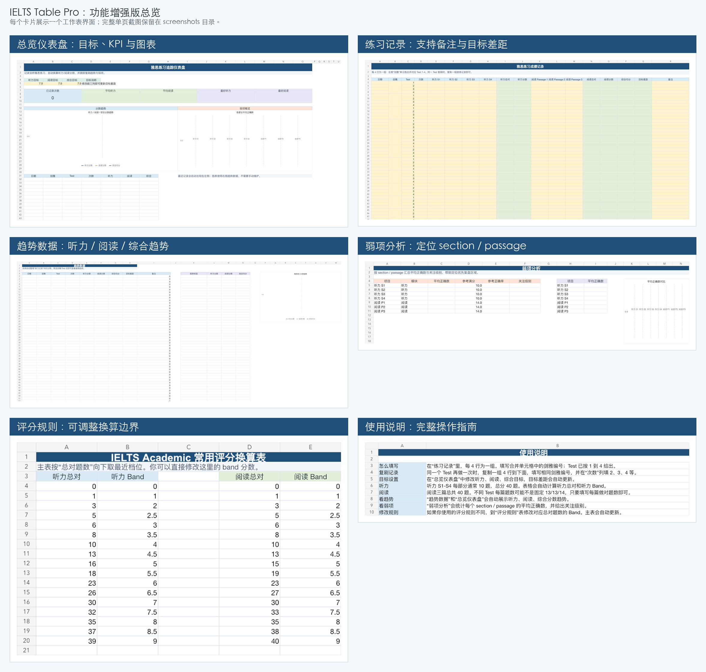
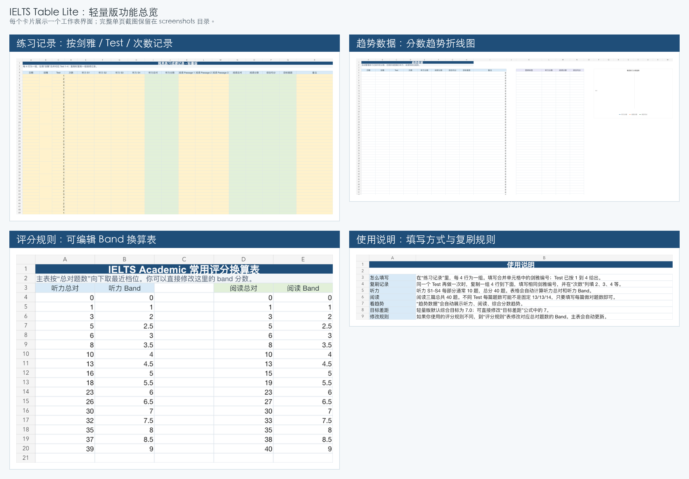

# IELTS Table

用于记录剑桥雅思练习成绩的 Excel 模板项目。仓库内提供两个开源版本：

- **Lite 轻量版**：适合日常快速记录、自动换算听力/阅读分数、查看基础趋势。
- **Pro 功能增强版**：在轻量版基础上增加总览仪表盘、目标追踪、弱项分析和更完整的可视化。

## 下载

| 版本 | 文件 | 适合场景 |
| --- | --- | --- |
| Lite 轻量版 | [`workbooks/IELTS_Practice_Tracker_Lite.xlsx`](workbooks/IELTS_Practice_Tracker_Lite.xlsx) | 只想简单记录练习成绩和趋势 |
| Pro 功能增强版 | [`workbooks/IELTS_Practice_Tracker_Pro.xlsx`](workbooks/IELTS_Practice_Tracker_Pro.xlsx) | 想作为作品集展示，或需要仪表盘与弱项分析 |

## 功能增强版总览

## 轻量版总览

## 主要功能

### Lite 轻量版

- 按「剑雅 + Test 1-4」组织练习记录。
- `剑雅` 单元格按 4 行合并，对应一本书的 4 个 Test。
- 支持同一个 Test 多次复刷，通过 `次数` 列记录第几次。
- 输入听力 S1-S4、阅读 Passage 1-3 的正确题数。
- 自动计算听力总对、阅读总对、听力分数、阅读分数和综合均分。
- `趋势数据` 工作表自动生成听力、阅读、综合分数折线图。
- `评分规则` 工作表可自行调整 Band 换算边界。

### Pro 功能增强版

包含轻量版全部功能，并额外提供：

- `总览仪表盘`：目标设置、KPI 卡片、趋势图、最近记录摘要。
- `弱项分析`：按听力 section 和阅读 passage 汇总平均正确数。
- `目标差距`：自动对比综合目标，看到当前练习离目标还有多少。
- 更完整的可视化结构，适合放入个人作品集。

## 工作表说明

| 工作表 | Lite | Pro | 作用 |
| --- | --- | --- | --- |
| `练习记录` | ✅ | ✅ | 主输入表，填写日期、剑雅、Test、次数、正确题数和备注 |
| `趋势数据` | ✅ | ✅ | 自动整理分数，并生成趋势折线图 |
| `评分规则` | ✅ | ✅ | 可编辑的听力 / 阅读 Band 换算表 |
| `使用说明` | ✅ | ✅ | 填写方式、复刷规则和评分规则说明 |
| `总览仪表盘` |  | ✅ | KPI、目标、趋势和弱项图表汇总 |
| `弱项分析` |  | ✅ | section / passage 维度的弱项定位 |

## 完整界面截图

### Lite 轻量版

| 界面 | 截图 |
| --- | --- |
| 练习记录 | [`screenshots/lite/练习记录.png`](screenshots/lite/练习记录.png) |
| 趋势数据 | [`screenshots/lite/趋势数据.png`](screenshots/lite/趋势数据.png) |
| 评分规则 | [`screenshots/lite/评分规则.png`](screenshots/lite/评分规则.png) |
| 使用说明 | [`screenshots/lite/使用说明.png`](screenshots/lite/使用说明.png) |

### Pro 功能增强版

| 界面 | 截图 |
| --- | --- |
| 总览仪表盘 | [`screenshots/pro/总览仪表盘.png`](screenshots/pro/总览仪表盘.png) |
| 练习记录 | [`screenshots/pro/练习记录.png`](screenshots/pro/练习记录.png) |
| 趋势数据 | [`screenshots/pro/趋势数据.png`](screenshots/pro/趋势数据.png) |
| 弱项分析 | [`screenshots/pro/弱项分析.png`](screenshots/pro/弱项分析.png) |
| 评分规则 | [`screenshots/pro/评分规则.png`](screenshots/pro/评分规则.png) |
| 使用说明 | [`screenshots/pro/使用说明.png`](screenshots/pro/使用说明.png) |

## 使用方法

1. 下载并打开需要的 Excel 文件。
2. 在 `练习记录` 中，每 4 行作为一组，填写合并单元格里的剑雅编号。
3. 填写对应 Test 的听力 S1-S4、阅读 Passage 1-3 正确题数。
4. 如果同一个 Test 重做，在下方复制一组 4 行，并把 `次数` 改成 2、3、4 等。
5. 查看 `趋势数据`；如果使用 Pro 版，也可以查看 `总览仪表盘` 和 `弱项分析`。

## 评分说明

模板使用常见 IELTS Academic 听力和阅读换算规则。不同资料或不同试卷可能存在细微边界差异，所以 `评分规则` 工作表是可编辑的。

## 开源协议

MIT License
