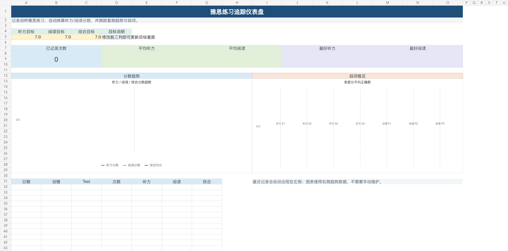
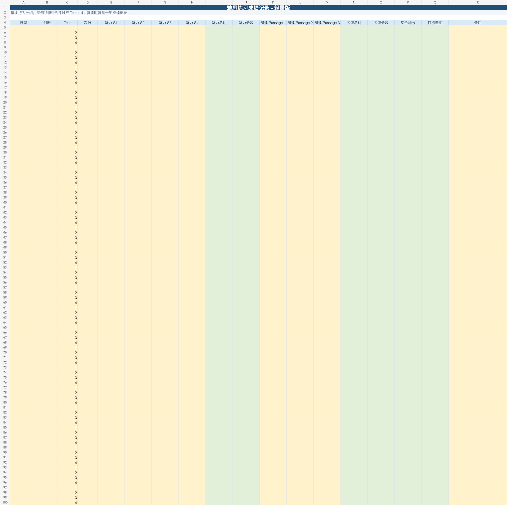

# IELTS Table

Two open-source Excel templates for tracking Cambridge IELTS practice performance.

This repository contains two editions:

- **Lite**: a lightweight workbook for daily score logging and trend tracking.
- **Pro**: a portfolio-style dashboard workbook with targets, KPIs, weakness analysis, and richer visuals.

## Download

| Edition | Workbook | Best for |
| --- | --- | --- |
| Lite | [`workbooks/IELTS_Practice_Tracker_Lite.xlsx`](workbooks/IELTS_Practice_Tracker_Lite.xlsx) | Simple practice logging |
| Pro | [`workbooks/IELTS_Practice_Tracker_Pro.xlsx`](workbooks/IELTS_Practice_Tracker_Pro.xlsx) | Dashboard, analytics, and portfolio presentation |

## Pro Preview

## Lite Preview

## Features

### Lite

- Cambridge IELTS book + Test 1-4 block layout.
- Merged `剑雅` cell spanning four Test rows.
- Repeat-attempt tracking through the `次数` column.
- Listening section and Reading passage correct-answer input.
- Automatic Listening and Academic Reading band conversion.
- Trend data sheet with Listening, Reading, and combined-score line chart.
- Editable scoring-rule table.

### Pro

Everything in Lite, plus:

- Dashboard with targets, KPI cards, trend chart, and recent-record summary.
- Weakness analysis by Listening S1-S4 and Reading Passage 1-3.
- Target-gap calculation.
- More polished workbook structure for portfolio use.

## Sheet Structure

| Sheet | Lite | Pro | Purpose |
| --- | --- | --- | --- |
| `练习记录` | yes | yes | Main input sheet |
| `趋势数据` | yes | yes | Normalized chart data and line chart |
| `评分规则` | yes | yes | Editable band-score conversion rules |
| `使用说明` | yes | yes | User instructions |
| `总览仪表盘` | no | yes | KPI dashboard and visual summary |
| `弱项分析` | no | yes | Section/passage-level weakness analysis |

## How To Use

1. Open either workbook in Excel.
2. In `练习记录`, fill one 4-row block for a Cambridge IELTS book.
3. Enter correct-answer counts for Listening S1-S4 and Reading Passage 1-3.
4. Use `次数` to record repeat attempts of the same test.
5. Review `趋势数据`; in Pro, also review `总览仪表盘` and `弱项分析`.

## Scoring Notes

The templates use common IELTS Academic Listening and Reading conversion bands. The scoring tables are intentionally editable in `评分规则`, because conversion boundaries can vary slightly by test and source.

## License

MIT
